# DSI Studio: a Reusable Data Analysis and Modelling App (R Shiny)

A point-and-click R Shiny app that takes any CSV through a complete modelling workflow: exploratory analysis, missing-data and outlier handling, preprocessing, and comparing 30+ regression models, with every step reproducible and every stage's data downloadable.

Built for the University of Canterbury course *Data Science in Industry* (DATA423, grade A+). The framework grew across three assignments, each adding a stage of the workflow: exploratory analysis (A1), missing data and outliers (A2), and model selection (A3).

**[▶ Try the live app](https://williamhuichang.shinyapps.io/dsi-studio/)** (free hosting: the first load after a quiet spell takes about a minute)

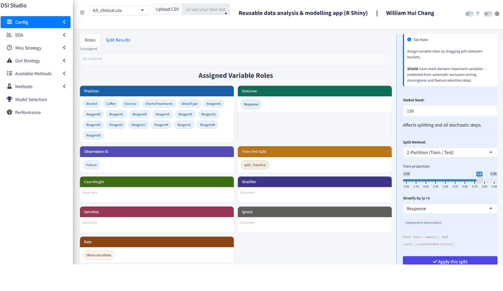

*A walkthrough of 15 views, from data roles through EDA, missing data and outliers to model selection. Full-size screenshots with captions are below.*

<details>
<summary><b>📸 All 15 screenshots (click to expand)</b></summary>

**1. Config: drag-and-drop column roles and a seeded, stratified train/test split (A3)**

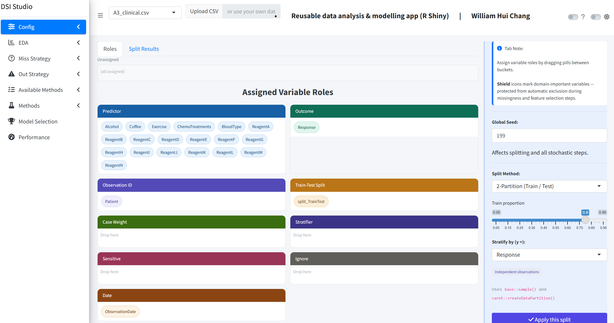

**2. EDA: word cloud of all values, exposing disguised missing codes such as `-99` and `--` (A2)**


**3. EDA: missingness map grouped by healthcare basis, showing missingness differs by group (A2)**

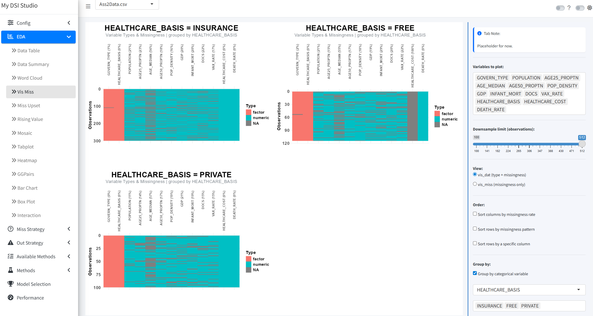

**4. EDA: variable types and missingness with rows sorted by population density (A2)**

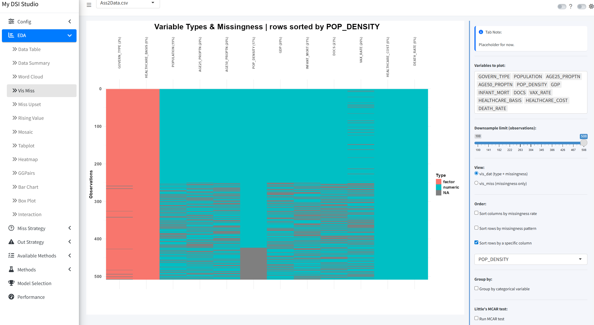

**5. EDA: rising-value graph to check each numeric variable for gaps and odd values (A3)**

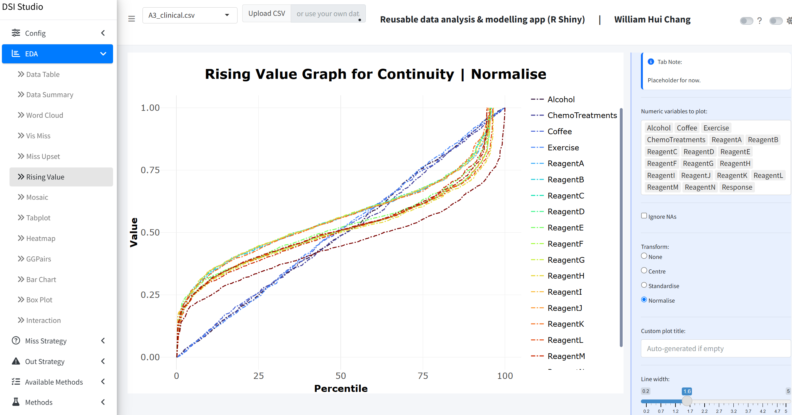

**6. EDA: pairs plot coloured by train/test split, checking the split is balanced (A3)**

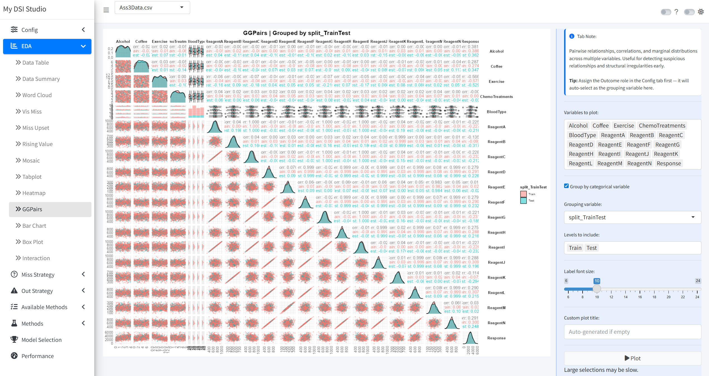

**7. EDA: standardised boxplots with outliers labelled by patient ID (A3)**

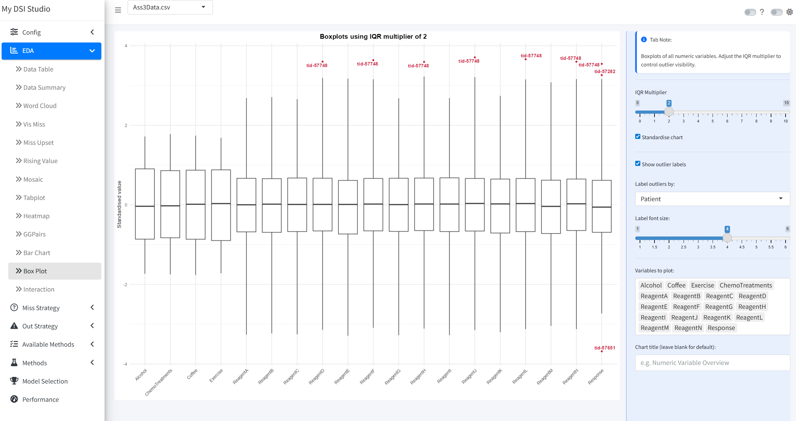

**8. Missing data: thresholds for dropping variables and observations with too many missing values (A2)**

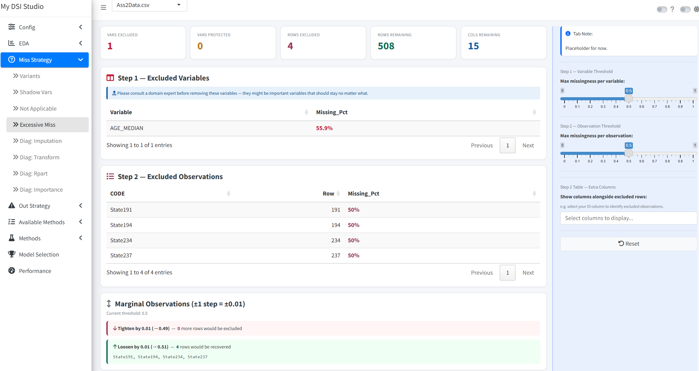

**9. Missing data: comparing KNN and bagged-tree imputation against the observed distributions (A3)**

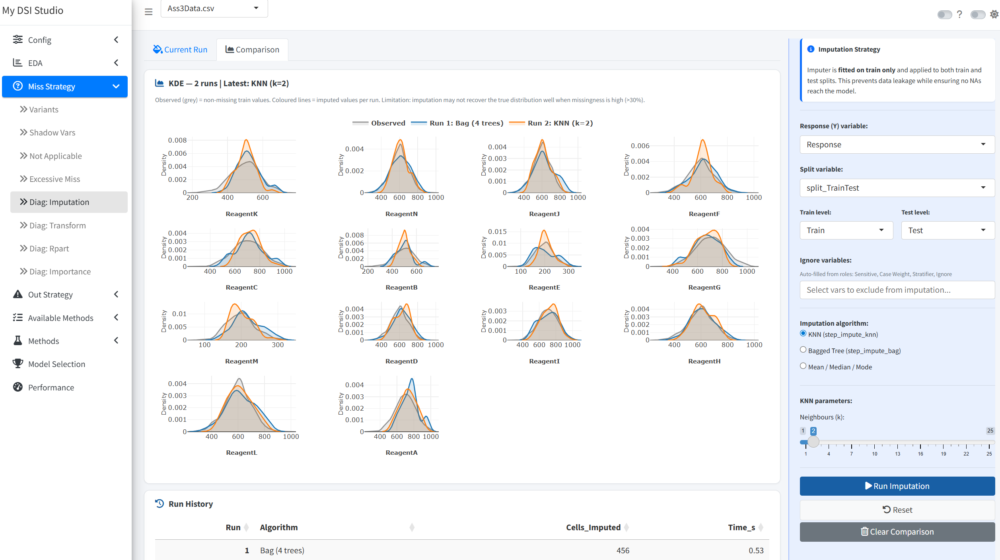

**10. Missing data: a decision tree predicting how many values an observation is missing, a check for non-random missingness (A2)**

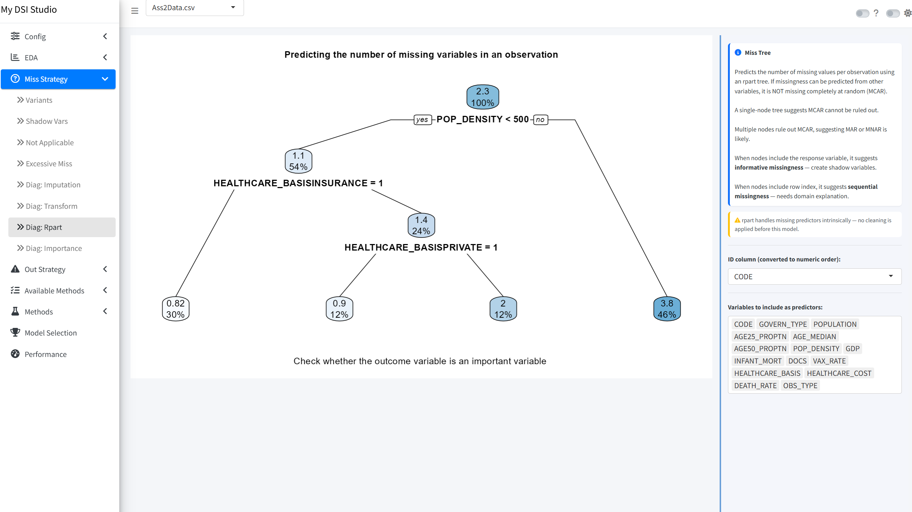

**11. Outliers: consensus across six detection methods; the tallest bars are flagged by the most methods (A3)**

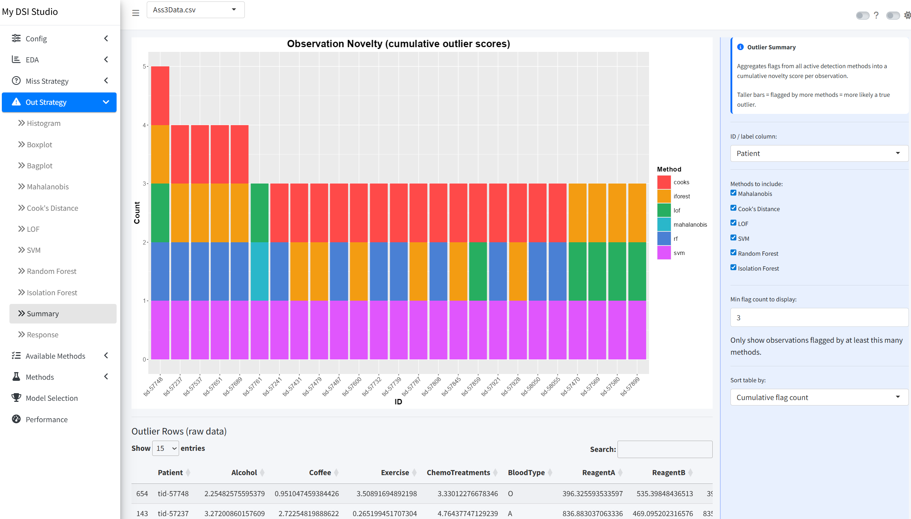

**12. Available methods: map of 239 caret models, grouped by model family**

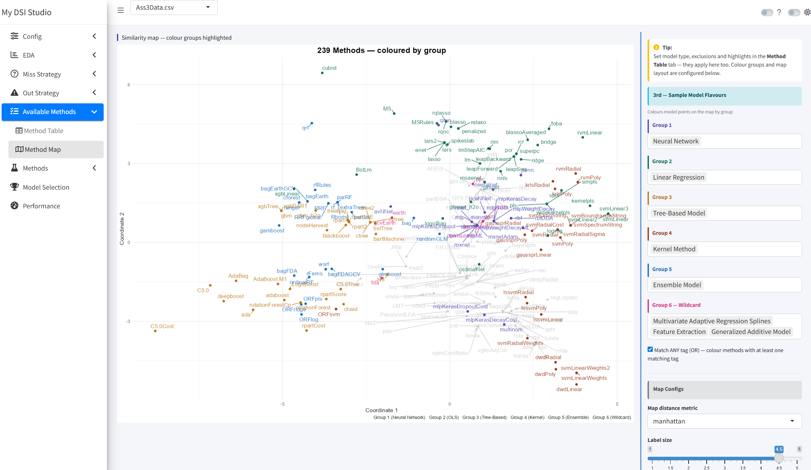

**13. Methods: tuning an SVM (polynomial kernel), RMSE by cost and degree**

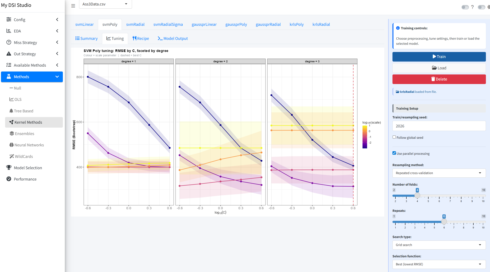

**14. Model selection: cross-validated MAE, RMSE and R² for ~30 trained models**

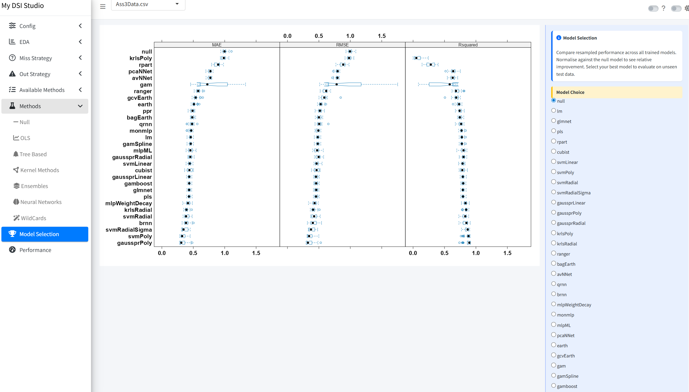

**15. Performance: the chosen model (glmnet) on unseen test data, with R² 0.77 and residual checks**

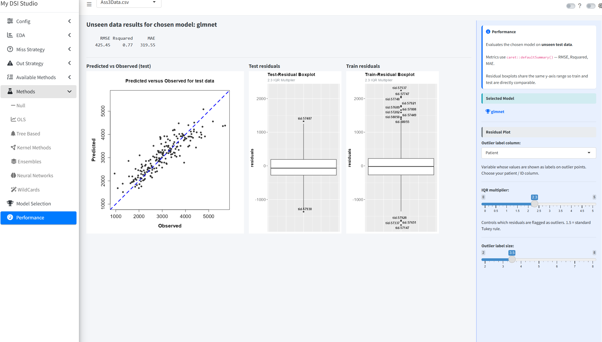

</details>

## What it does

The sidebar follows the order of a real analysis. Each stage passes its cleaned data to the next.

| Stage | What you can do |
|---|---|
| **Config** | Assign column roles (outcome, ID, date, train/test split, weights, stratifier, sensitive, ignore); split the data 6 ways (train/test, train/validation/test, stratified bootstrap, leave-group-out, time series, diversity sampling) with fixed seeds; download the data at any stage |
| **EDA** (13 views) | Data table, summary, word cloud, missingness map and UpSet plot, rising-value plot, mosaic, tabplot, correlation heatmap, pairs plot, bar and box plots, interaction plots |
| **Missing data** (8 tools) | Detect disguised missing codes (e.g. `-99`, `--`), add shadow variables, treat "not applicable" values, drop excessively missing rows/columns, compare imputation methods (KNN, bagged trees, median/mode), check transformations, and model *why* data is missing (rpart tree, variable importance) |
| **Outliers** (11 tools) | Histogram, boxplot, bagplot, Mahalanobis distance, Cook's distance, local outlier factor, one-class SVM, random forest, isolation forest, a consensus summary across methods, and outcome (response) outliers |
| **Models** | Browse caret's model catalogue as a table or map, then train models from 7 families (null baseline, linear/regularised, trees, kernel methods, ensembles, neural networks, wildcards such as MARS and M5). Each model gets its own chain of up to 31 preprocessing steps (imputation, transforms, PCA/PLS, dummy coding, interactions and more) |
| **Selection & performance** | Compare cross-validated results across all trained models, pick one, and check it on the held-out test set |

## Three assignments, one app

Each assignment came with its own dataset (synthetic data provided for the course), and all three are bundled with their roles pre-set. Pick one from the dropdown in the header.

| Assignment | Dataset | Focus | Where to look |
|---|---|---|---|
| **A1: Exploratory analysis** | `A1_manufacturing.csv`: a manufacturing process with 30 sensor readings and categorical process variables | Use EDA graphics to reveal data problems before any modelling: missing-value patterns, suspicious or disguised values, outliers and relationships between variables | **EDA** tabs |
| **A2: Missing data and outliers** | `A2_public_health.csv`: death rates with health and economic indicators; about 15% of values missing | Handle missingness and outliers properly: find disguised missing codes, treat "not applicable" values, drop excessively missing data, compare imputation methods, and flag outliers with several methods | **Miss Strategy** and **Out Strategy** |
| **A3: Model selection** | `A3_clinical.csv` (opens by default): patient response from reagent measurements and lifestyle factors | Build a preprocessing pipeline per model, train and compare many model types, choose one, and test it on unseen data | **Methods**, **Model Selection**, **Performance** |

You can also use **Upload CSV** in the header to load your own file (up to 10 MB).

**Quick look at A3:** open *Methods → OLS*, pick `glmnet` and click **Load** to use a pre-trained model instead of training one, then open *Model Selection* and *Performance*. A3 is split into train and test sets automatically, and A2 uses its own `OBS_TYPE` column; for A1 or your own data, create the split in *Config → Data Roles* and stratify it by the outcome.

## How it's built

- **Modular:** 45 Shiny modules, one per view or step, found and loaded automatically from the `modules/` folder. Adding a view means adding one file.
- **Chained pipeline:** raw data → missing-value variants → shadow variables → "not applicable" handling → excessive missingness → response outliers → imputation → transformation. Each stage is a reactive step, so changing an early choice updates everything downstream.
- **Config-driven:** dataset-specific defaults (roles, seeds, preprocessing per model) live in `global.R`, so the same app serves any dataset.
- **Reproducible:** fixed seeds for splitting and model training; trained models are saved and can be reloaded.

## Run it locally

Requires R (4.3+) and the packages loaded in `global.R` and `modules/method/mod_meth_shared.R`.

```r
shiny::runApp(".")   # from this folder, or open ui.R in RStudio and click Run App
```

To deploy your own copy to shinyapps.io, see `deploy.R`.

## Repository contents

```
global.R, ui.R, server.R   app entry points and configuration
modules/                   config, eda, miss, out and method modules
data/                      the three bundled datasets
deploy.R                   one-command deployment to shinyapps.io
screenshots/               README screenshots and slideshow
```

## Credits

- Course: DATA423 Data Science in Industry, University of Canterbury (lecturer: Phil Davies).
- Built with [shiny](https://shiny.posit.co/), [bs4Dash](https://rinterface.github.io/bs4Dash/), [caret](https://topepo.github.io/caret/) and [recipes](https://recipes.tidymodels.org/).
- The hosting changes (file upload, per-visitor model storage, single-core training when hosted) were made with AI-assisted coding.
